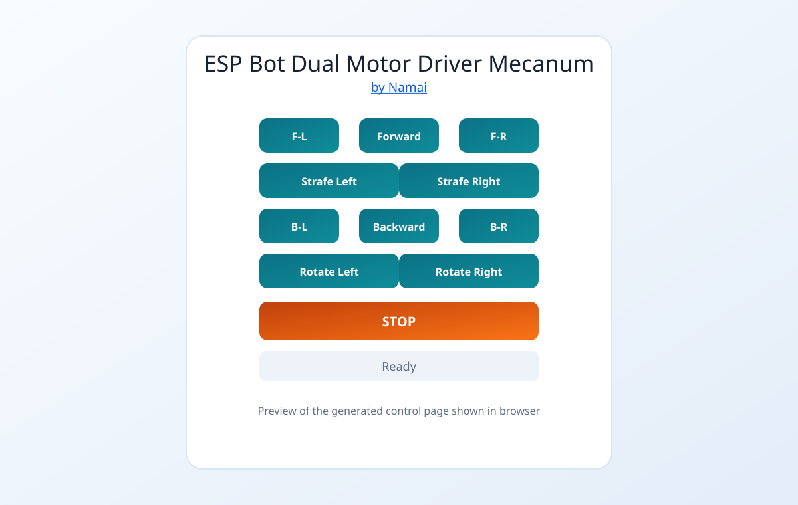
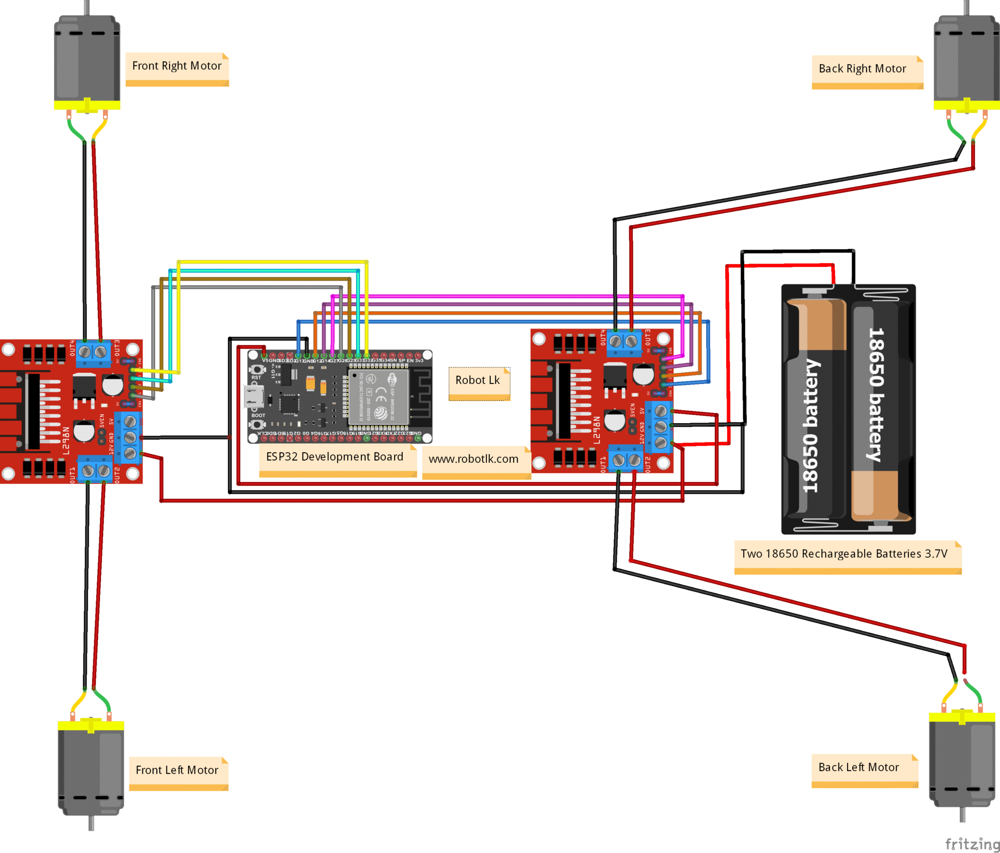

# ESP Bot Dual Motor Driver Mecanum (Fully Functional) by [Namai](https://www.youtube.com/@-MRFUN)

This is the fully functional mecanum version with dual L298N motor drivers and browser control.

All code in this repository is for ESP8266 builds (not ESP32).

It is the ESP8266 conversion of your full mecanum control logic, including:
- Forward and Backward
- Strafe Left and Strafe Right
- Rotate Left and Rotate Right
- Forward-Left and Forward-Right
- Backward-Left and Backward-Right
- Stop

## Files in This Folder
- mecanum_wheel_bot.ino
- dual_mecanum_diagram.png
- web_ui_preview.svg

## Step-by-Step Guide
1. Install Arduino IDE: https://www.arduino.cc/en/software
2. In Arduino IDE Preferences, add board URL:
   http://arduino.esp8266.com/stable/package_esp8266com_index.json
3. Install ESP8266 board package from Boards Manager.
4. Open mecanum_wheel_bot.ino and select NodeMCU 1.0 (ESP-12E Module).
5. Upload code to ESP8266.
6. Connect phone to WiFi SSID: IITM-DIY-Mecanum-2D (password: 12345678).
7. Open browser and go to http://192.168.4.1

## Which URL Students Should Open
- Open exactly: http://192.168.4.1
- This works because the ESP8266 is running in Wi-Fi Access Point mode, and its default AP IP is 192.168.4.1.
- Root path is used, so students should open just http://192.168.4.1 (same as http://192.168.4.1/).
- If the page does not open immediately, disable mobile data on the phone and reconnect to the IITM-DIY-Mecanum-2D network.

## How to Customize Wi-Fi Name, Password, and URL
- In mecanum_wheel_bot.ino, edit:
   - ssid (Wi-Fi network name shown to students)
   - password (minimum 8 characters)
- If you keep default AP settings, URL remains http://192.168.4.1.
- If you set a custom AP IP in code with WiFi.softAPConfig(...), students must open that new IP instead.

## Web Page Preview
This is the control page students will see after opening the URL:

## Wiring (Merged Guide)

### ESP8266 to L298N Inputs (Matches the Code)
Driver 1 (Front):
- IN1 -> GPIO5 (D1)
- IN2 -> GPIO4 (D2)
- IN3 -> GPIO14 (D5)
- IN4 -> GPIO12 (D6)

Driver 2 (Back):
- IN1 -> GPIO13 (D7)
- IN2 -> GPIO16 (D0)
- IN3 -> GPIO3 (RX)
- IN4 -> GPIO1 (TX)

### Driver to Motors
First L298N (front motors):
- Front-left motor red -> OUT2
- Front-left motor black -> OUT1
- Front-right motor red -> OUT3
- Front-right motor black -> OUT4

Second L298N (back motors):
- Back-left motor red -> OUT2
- Back-left motor black -> OUT1
- Back-right motor red -> OUT3
- Back-right motor black -> OUT4

### Power and Ground
- Common GND is mandatory across ESP8266 and both L298N boards.
- Use proper battery supply for motors through each L298N motor power input.
- Keep L298N 5V and ESP8266 power wiring stable and correctly regulated.

### ESP32 Reference Mapping (Not Used in This Repository)
This is the mapping you shared, kept here as a text reference only:

Driver 1 (Front):
- IN1 -> GPIO13
- IN2 -> GPIO12
- IN3 -> GPIO14
- IN4 -> GPIO27

Driver 2 (Back):
- IN1 -> GPIO26
- IN2 -> GPIO25
- IN3 -> GPIO33
- IN4 -> GPIO32

### Boot Safety Note for ESP8266
- The dual ESP8266 mapping above avoids boot-strap pins GPIO0, GPIO2, and GPIO15 to prevent boot lock issues.
- RX/TX are used as motor outputs, so do not use Serial Monitor control while motors are connected.
- You may still see a brief motor twitch at power-on due to boot serial output on TX, but this does not block boot.

## Connection Diagram

## Inspiration
Made by Namai: https://www.youtube.com/@-MRFUN
