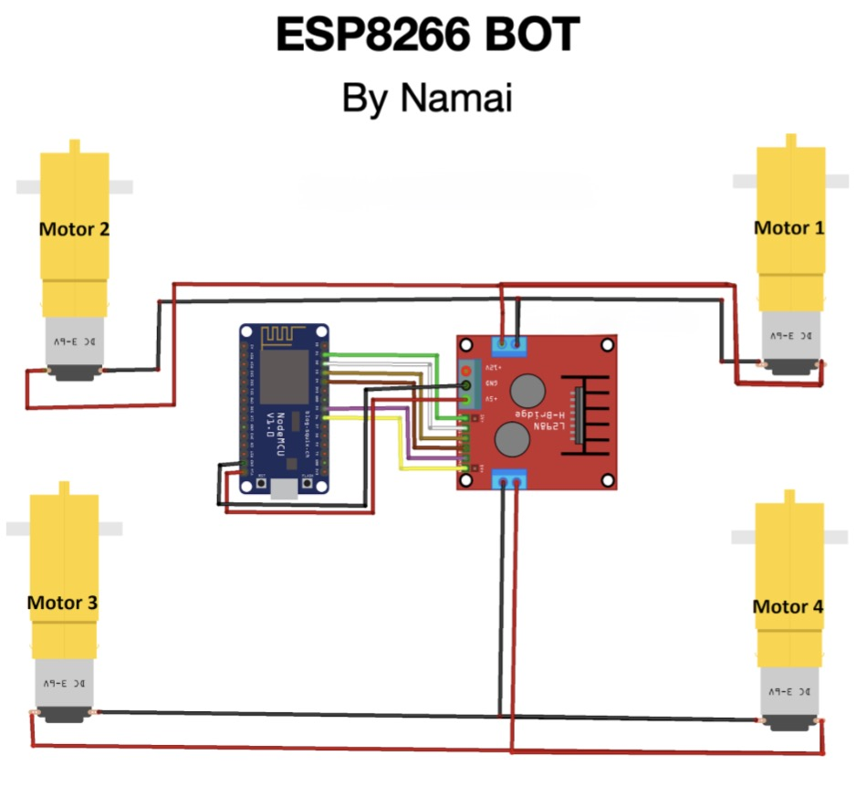

# Single Motor Driver Mecanum

This version uses one L298N with a mecanum chassis. It is controlled from a mobile-friendly web page and is ideal for a basic build.

Note: With a single driver, motion is similar to normal drive control (Forward, Backward, Left, Right, Stop).

## Files in This Folder
- single_motor_driver_mecanum.ino
- connections.md
- connection_diagram.jpg

## Step-by-Step Guide
1. Install Arduino IDE: https://www.arduino.cc/en/software
2. In Arduino IDE Preferences, add board URL:
   http://arduino.esp8266.com/stable/package_esp8266com_index.json
3. Install ESP8266 board package from Boards Manager.
4. Open single_motor_driver_mecanum.ino and select NodeMCU 1.0 (ESP-12E Module).
5. Upload code to ESP8266.
6. Connect phone to WiFi SSID: IITM-DIY-Mecanum-1D (password: 12345678).
7. Open browser and go to http://192.168.4.1

## Connection Diagram
Same connection style as the normal DIY single-driver build:

# Connections - Single Motor Driver Mecanum

## ESP8266 to L298N
- D1 (GPIO5) -> ENA
- D6 (GPIO12) -> ENB
- D2 (GPIO4) -> IN1
- D3 (GPIO0) -> IN2
- D4 (GPIO2) -> IN3
- D5 (GPIO14) -> IN4
- GND -> GND

## L298N to Motors
Use one channel for left side and one channel for right side.

Left side motors (front-left and back-left in parallel):
- Red wire -> OUT2
- Black wire -> OUT1

Right side motors (front-right and back-right in parallel):
- Red wire -> OUT3
- Black wire -> OUT4

## Inspiration
Made by Namai: https://www.youtube.com/@-MRFUN
